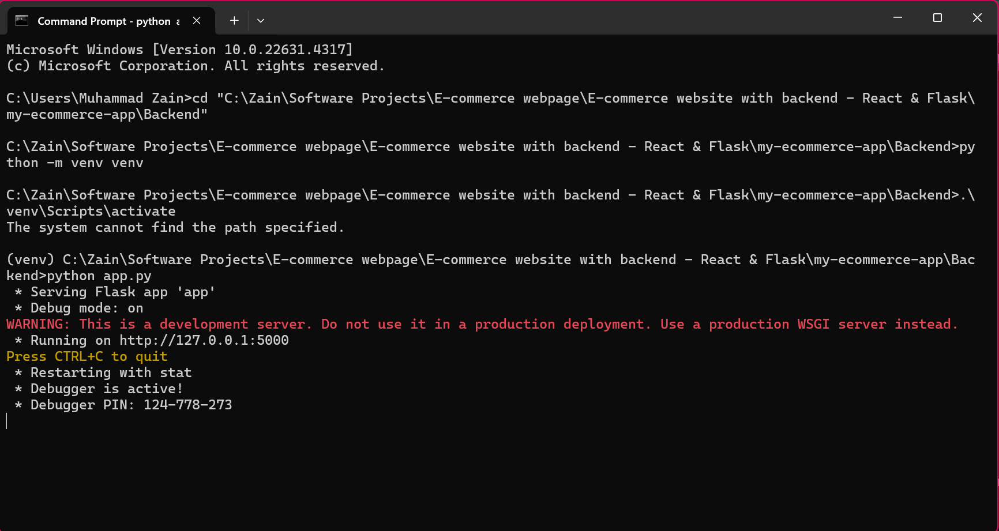
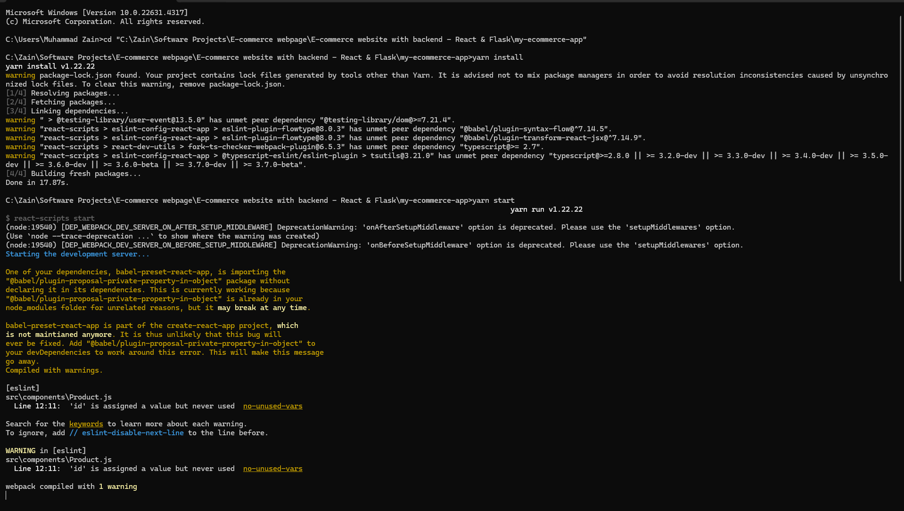
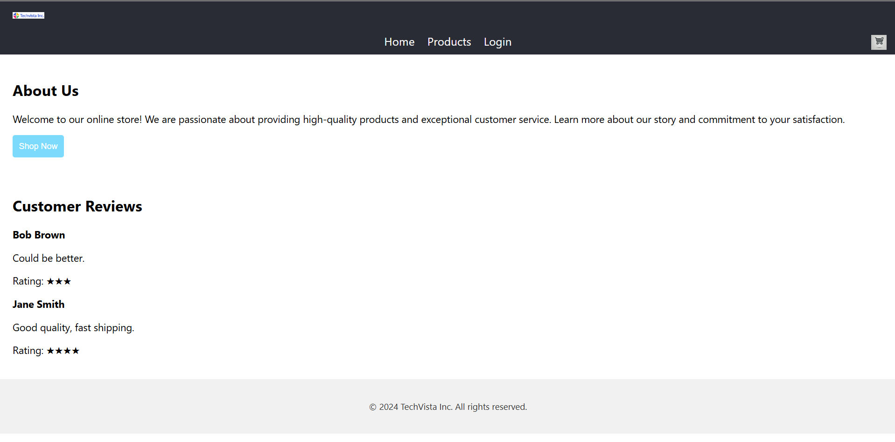
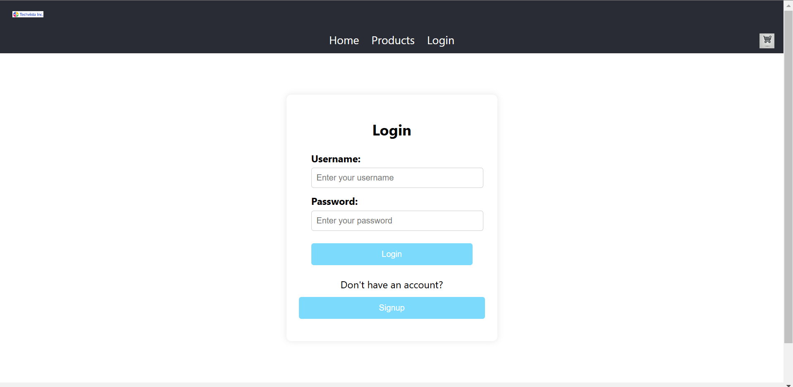
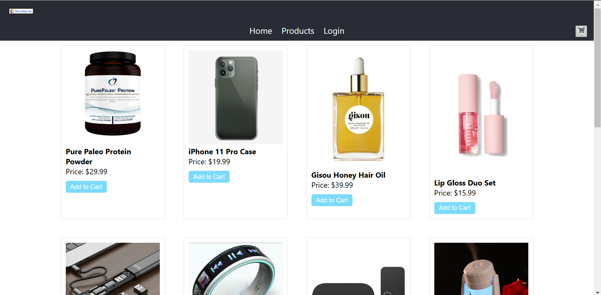
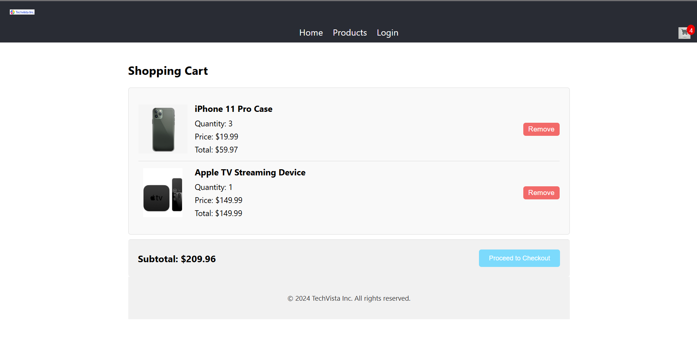

# TechVista Inc. E-commerce Web Application

Welcome to the **TechVista Inc.** e-commerce web application! This project is a modern, easy-to-use online store where users can browse products, add them to their shopping cart, and proceed to checkout.

## Project Overview

The TechVista Inc. e-commerce platform is built using:
- **Frontend**: React.js – a popular framework for building dynamic user interfaces.
- **Backend**: Flask – a lightweight web server to handle data processing.
- **Database**: SQLite – a simple and efficient database for storing product and cart information.

### Key Features
- **Product Listing**: Users can view a list of available products.
- **Shopping Cart**: Add products to the cart, view quantity, and remove items.
- **Authentication**: Users can log in and sign up (optional in this setup).
- **Dynamic Updates**: The cart icon shows the number of items currently in the cart.

## Getting Started

Follow these steps to set up the project locally. This guide assumes you are not familiar with programming, so each step is explained in detail.

### Prerequisites

1. **Install Node.js**: 
   - Download Node.js from [nodejs.org](https://nodejs.org/).
   - Follow the installation instructions on the website.
   - Verify the installation by opening a command prompt or terminal and typing:
     ```bash
     node -v
     npm -v
     ```
   - You should see version numbers for both Node.js and npm (Node's package manager).

2. **Install Python**:
   - Download Python from [python.org](https://www.python.org/).
   - Follow the installation instructions.
   - Verify the installation by opening a command prompt or terminal and typing:
     ```bash
     python --version
     ```
   - You should see the Python version number.

3. **Install Git** (optional but recommended for managing updates):
   - Download Git from [git-scm.com](https://git-scm.com/).
   - Follow the installation instructions.

### Project Setup

1. **Clone the Repository** (if you have Git):
   - Open a command prompt or terminal.
   - Run:
     ```bash
     git clone https://github.com/muhammadzain03/TechVista-Inc.git
     ```
   **OR** download the ZIP file of this project from GitHub and unzip it on your computer.

2. **Install Frontend Dependencies**:
   - Open a command prompt or terminal.
   - Navigate to the project’s frontend folder (e.g., `my-ecommerce-app`).
   - Run:
     ```bash
     npm install
     ```
   - This will install the necessary packages for the frontend.

3. **Set Up the Backend**:
   - Navigate to the backend folder in the project.
   - (Optional) Create a virtual environment for Python (recommended):
     ```bash
     python -m venv venv
     ```
   - Activate the virtual environment:
     - **Windows**: `venv\Scripts\activate`
     - **Mac/Linux**: `source venv/bin/activate`
   - Install Flask and other dependencies:
     ```bash
     pip install -r requirements.txt
     ```
   - This will install the necessary Python packages.

4. **Database Setup** (SQLite):
   - The project uses a pre-configured SQLite database, so no setup is required.
   - If you'd like to reset the database, delete the `.sqlite` file in the backend directory.

### Running the Project

Follow these steps to run both the frontend and backend servers.

1. **Start the Backend**:
   - In the backend folder, make sure the virtual environment is activated.
   - Run:
     ```bash
     flask run
     ```
   - The backend will start running at [http://127.0.0.1:5000](http://127.0.0.1:5000).
   
   
     
2. **Start the Frontend**:
   - In a new terminal or command prompt, navigate to the frontend folder.
   - Run:
     ```bash
     npm start
     ```
   - The frontend will start running at [http://localhost:3000](http://localhost:3000).
   
   

Now, you can open [http://localhost:3000](http://localhost:3000) in your web browser to use the TechVista Inc. application.

### Using the Application

1. **Browse Products**: Visit the Products page to see a list of available items.
2. **Add to Cart**: Click "Add to Cart" on any product you’d like to purchase.
3. **View Cart**: Click on the cart icon in the header to view items in your cart.
4. **Adjust Quantities**: In the cart, you can adjust the quantity or remove items.
5. **Checkout** (optional): If implemented, proceed to checkout after reviewing your cart.

<p align="center">
  
  
  
  
</p>

### File Structure

Here's an overview of the project structure:

```
techvista-ecommerce/
├── backend/
│   ├── app.py               # Main Flask app file
│   ├── requirements.txt     # Backend dependencies
│   └── database.sqlite      # SQLite database
├── frontend/
│   ├── public/
│   ├── src/
│   │   ├── components/      # React components
│   │   ├── App.js           # Main React app file
│   │   └── App.css          # Main styling file
│   └── package.json         # Frontend dependencies
└── README.md                # Project documentation
```

## Technologies Used

- **React.js** for the frontend
- **Flask** for the backend
- **SQLite** for the database
- **CSS** for styling

## Troubleshooting

If you encounter issues:
- Make sure all dependencies are installed with `npm install` and `pip install -r requirements.txt`.
- Ensure the backend is running on port `5000` and the frontend on `3000`.
- If ports are occupied, close other applications using those ports or specify different ones.

## Contributing

If you’d like to contribute:
1. Fork the repository.
2. Create a feature branch: `git checkout -b feature-name`.
3. Commit your changes: `git commit -m "Add feature"`.
4. Push to the branch: `git push origin feature-name`.
5. Open a pull request.

## License

This project is licensed under the MIT License.
