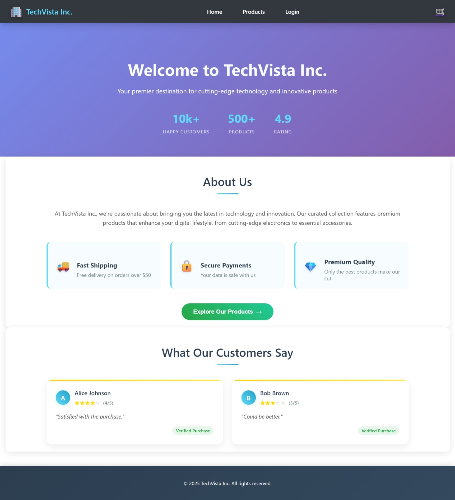
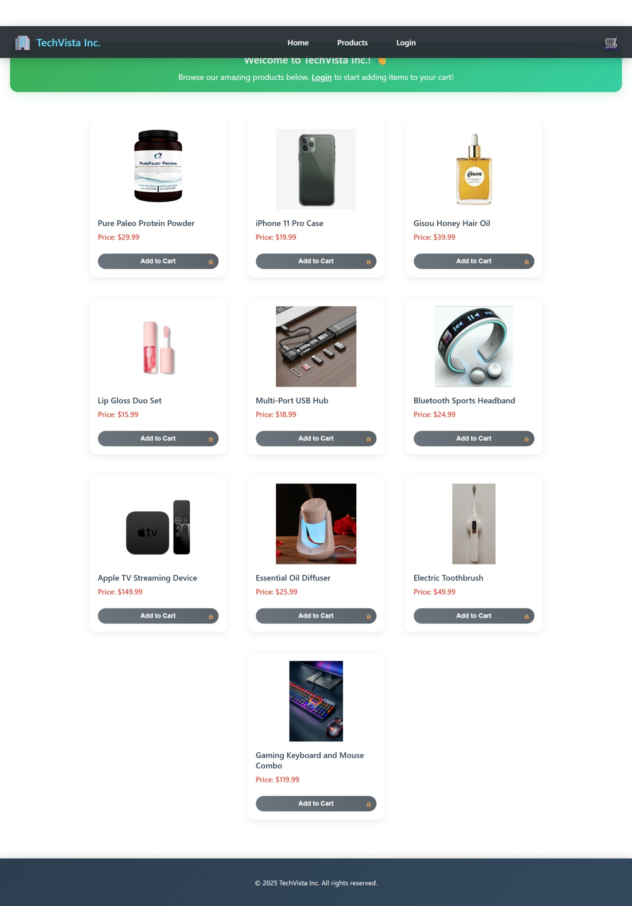
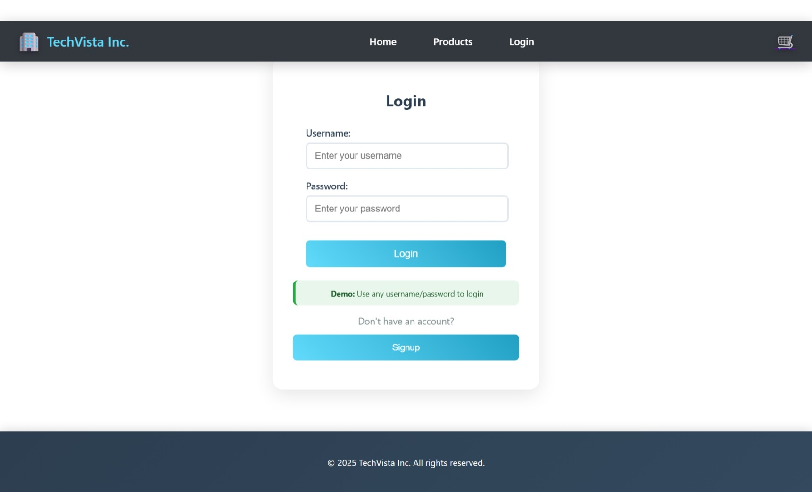
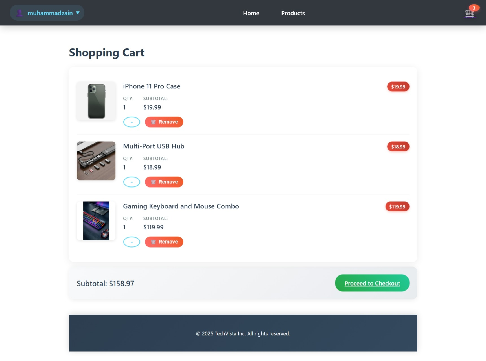
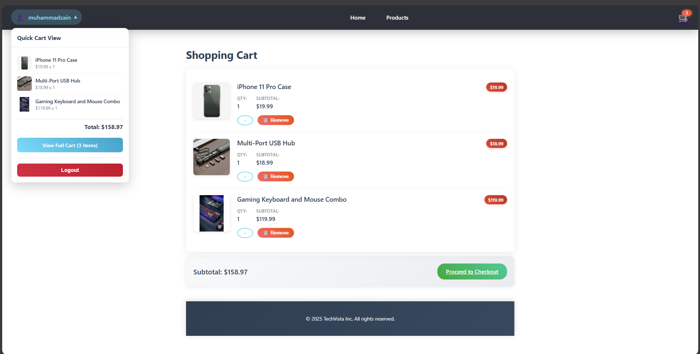
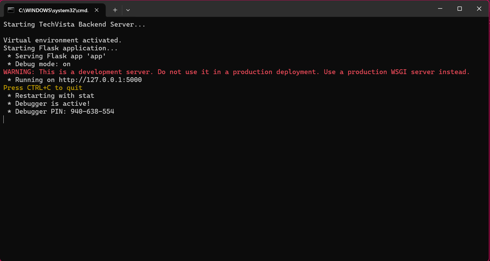
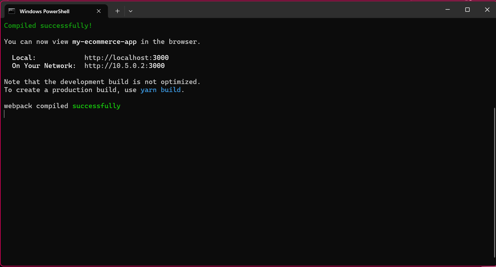

# 🛒 TechVista Inc. E-commerce Platform

<div align="center">

**A Modern, Beautiful E-commerce Web Application**


[](https://reactjs.org/)
[](https://flask.palletsprojects.com/)
[](https://sqlite.org/)

</div>

---

## 🌟 **Welcome to TechVista Inc.**

Experience the future of online shopping with our modern, feature-rich e-commerce platform! Built with cutting-edge technologies and stunning animations, TechVista Inc. offers a seamless shopping experience for both guests and registered users.

### 🔗 **Quick Links**
- 📦 **[View Repository](https://github.com/muhammadzain03/TechVista-Inc)**
- 📝 **[Report Issues](https://github.com/muhammadzain03/TechVista-Inc/issues)**
- 👨‍💻 **[Developer Profile](https://github.com/muhammadzain03)**

## ✨ **Key Features**

### 🎨 **Beautiful User Experience**
- ✅ **Modern Animations** - Smooth transitions, hover effects, and loading animations
- ✅ **Responsive Design** - Perfect on desktop, tablet, and mobile devices
- ✅ **Glassmorphism UI** - Contemporary design with backdrop filters and gradients
- ✅ **Interactive Elements** - Engaging micro-interactions throughout the platform

### 👥 **Smart User Management**
- ✅ **Guest Browsing** - View products without registration required
- ✅ **Secure Authentication** - Safe login and registration system
- ✅ **User Profile Dropdown** - Quick access to cart and account options
- ✅ **Smart Cart Preview** - Hover over profile to see cart contents

### 🛍️ **Advanced Shopping Features**
- ✅ **Product Catalog** - Browse beautiful product listings with details
- ✅ **Smart Cart System** - Add, remove, and manage cart items
- ✅ **Guest Cart Protection** - Login prompts for non-registered users
- ✅ **Real-time Updates** - Dynamic cart counters and instant feedback
- ✅ **Checkout Flow** - Under construction page with order summary

### 🎭 **Enhanced Interactions**
- ✅ **Loading Skeletons** - Elegant loading states while fetching data
- ✅ **Error Handling** - Graceful error messages with retry options
- ✅ **Login Prompts** - Friendly nudges for guests to register
- ✅ **Animated Feedback** - Visual confirmations for all user actions

---

## 📸 **Screenshots**

### 🏠 **Homepage - Welcome Experience**
<p align="center">
  
</p>

*Beautiful hero section with company stats and customer reviews*

### 🛍️ **Products Page - Guest & User Views**
<p align="center">
  
</p>

*Browse products with guest banner and smart cart buttons*

### 🔐 **Login Page - Secure Authentication**
<p align="center">
  
</p>

*Clean, modern login interface with form validation*

### 🛒 **Shopping Cart - Enhanced Experience**
<p align="center">
  
</p>

*Detailed cart management with quantity controls and totals*

### 👤 **User Profile & Cart Preview**
<p align="center">
  
</p>

*Hover dropdown showing cart contents and quick actions*

---

## 🚀 **Quick Start**

### 📋 **Prerequisites**

Before you begin, ensure you have:

- **Node.js** (v14 or higher) - [Download here](https://nodejs.org/)
- **Python** (v3.8 or higher) - [Download here](https://python.org/)
- **Git** (optional) - [Download here](https://git-scm.com/)

### ⚡ **One-Click Setup**

**The easiest way to run TechVista Inc.:**

1. **Clone the Repository**:
   ```bash
   git clone https://github.com/muhammadzain03/TechVista-Inc.git
   cd TechVista-Inc
   ```
   **OR** [Download ZIP](https://github.com/muhammadzain03/TechVista-Inc/archive/refs/heads/main.zip) and extract
2. **Double-click** `start_project.bat` in the main folder
3. **Wait** for both servers to start automatically
4. **Visit** http://localhost:3000 in your browser

The batch file will:
- ✅ Set up Python virtual environment
- ✅ Install all dependencies
- ✅ Start both frontend and backend servers
- ✅ Open the website in your browser

### 🖥️ **Server Screenshots**

#### Backend Server (Flask - Port 5000)
<p align="center">
  
</p>

#### Frontend Server (React - Port 3000)
<p align="center">
  
</p>

---

## 🎯 **How to Use**

### 👤 **For Guests (No Account Required)**
1. **Browse Products** - View all available items and details
2. **See Prices** - Check product information and descriptions
3. **Try to Add to Cart** - Get friendly login prompts
4. **Easy Registration** - Quick signup when ready to purchase

### 🔑 **For Registered Users**
1. **Login** - Access your personal account
2. **Shop Freely** - Add items to cart without restrictions
3. **Manage Cart** - View, update, and remove items
4. **Profile Access** - Hover over profile for quick cart preview
5. **Secure Checkout** - Proceed to checkout (under construction)

---

## 🏗️ **Project Structure**

```
TechVista Inc/
├── 📱 Frontend (React.js)
│   ├── public/
│   │   ├── images/          # Product and brand images
│   │   └── index.html       # Main HTML template
│   ├── src/
│   │   ├── components/      # React components
│   │   │   ├── Header.js           # Navigation with user profile
│   │   │   ├── ProductList.js      # Product catalog with guest banner
│   │   │   ├── Product.js          # Individual product cards
│   │   │   ├── CartPage.js         # Shopping cart management
│   │   │   ├── CheckoutPage.js     # Under construction page
│   │   │   ├── LoginForm.js        # Authentication forms
│   │   │   └── HomeMainSection.js  # Homepage hero & reviews
│   │   ├── App.js           # Main app with routing
│   │   └── App.css          # Beautiful animations & styling
│   └── package.json         # Dependencies & scripts
├── 🗄️ Backend (Flask)
│   ├── app.py              # API endpoints & data handling
│   ├── requirements.txt    # Python dependencies
│   └── venv/              # Virtual environment
├── 🖼️ Assets
│   ├── Home_Page.jpeg      # Homepage screenshot
│   ├── Products_Page.jpeg  # Products page screenshot
│   ├── Login_Page.jpeg     # Login page screenshot
│   ├── Cart_Page.jpeg      # Cart page screenshot
│   └── Cart_Profile.png    # Profile dropdown screenshot
├── ⚡ Automation
│   ├── start_project.bat   # One-click startup script
│   ├── start_backend.bat   # Backend server launcher
│   └── start_frontend.bat  # Frontend server launcher
└── 📚 Documentation
    └── README.md           # This beautiful guide!
```

---

## 🛠️ **Technologies & Features**

### 🎨 **Frontend Stack**
- **React.js 18** - Modern component-based UI
- **React Router** - Seamless page navigation
- **CSS3 Animations** - Smooth transitions and effects
- **Responsive Design** - Mobile-first approach
- **Modern UI/UX** - Glassmorphism and gradients

### ⚙️ **Backend Stack**
- **Flask 3.x** - Lightweight Python web framework
- **Flask-CORS** - Cross-origin resource sharing
- **Werkzeug** - Secure password hashing
- **SQLite** - Embedded database solution

### ✨ **Special Features**
- **Guest Browsing** - No signup required to view products
- **Smart Cart Logic** - Login prompts for cart actions
- **Loading Skeletons** - Beautiful loading states
- **Error Boundaries** - Graceful error handling
- **Profile Dropdown** - Quick cart access on hover
- **Responsive Design** - Works on all devices
- **Batch Automation** - One-click setup and launch

---

## 🎨 **Design Highlights**

### 🌈 **Visual Elements**
- **Gradient Backgrounds** - Beautiful color transitions
- **Glassmorphism Effects** - Modern backdrop filters
- **Smooth Animations** - Engaging micro-interactions
- **Consistent Typography** - Clean, readable fonts
- **Smart Color Scheme** - Professional blue and green palette

### 🎭 **Interactive Features**
- **Hover Effects** - Responsive visual feedback
- **Loading States** - Skeleton screens and spinners
- **Button Animations** - Ripple effects and transitions
- **Form Validation** - Real-time input feedback
- **Cart Animations** - Smooth add/remove transitions

---

## 🔧 **Manual Setup** (Alternative)

If you prefer manual setup:

### Backend Setup
```bash
cd Backend
python -m venv venv
venv\Scripts\activate          # Windows
# source venv/bin/activate     # Mac/Linux
pip install -r requirements.txt
python app.py
```

### Frontend Setup
```bash
npm install
npm start
```

---

## 🚀 **Deployment Ready**

This project is ready for deployment on:
- **Vercel** (Frontend) - [Deploy Now](https://vercel.com/new/clone?repository-url=https://github.com/muhammadzain03/TechVista-Inc)
- **Heroku** (Backend)
- **Netlify** (Frontend)
- **Railway** (Full-stack)

---

## 🤝 **Contributing**

We welcome contributions! Here's how:

### 🐛 **Found a Bug or Have a Feature Request?**
- **Report Issues**: [Create an Issue](https://github.com/muhammadzain03/TechVista-Inc/issues/new)
- **Request Features**: [Feature Request](https://github.com/muhammadzain03/TechVista-Inc/issues/new)

### 💻 **Want to Contribute Code?**
1. **Fork** the [repository](https://github.com/muhammadzain03/TechVista-Inc)
2. **Create** a feature branch: `git checkout -b amazing-feature`
3. **Commit** your changes: `git commit -m "Add amazing feature"`
4. **Push** to the branch: `git push origin amazing-feature`
5. **Open** a [Pull Request](https://github.com/muhammadzain03/TechVista-Inc/pulls)

---

## 📝 **License**

This project is licensed under the **MIT License** - see the [LICENSE](LICENSE) file for details.

---

<div align="center">

**Made with ❤️ by [Muhammad Zain](https://github.com/muhammadzain03)**

*Software Engineering Student at University of Calgary*  
*Building the future of e-commerce, one pixel at a time*

⭐ **[Star this repo](https://github.com/muhammadzain03/TechVista-Inc) if you found it helpful!** ⭐

</div>
